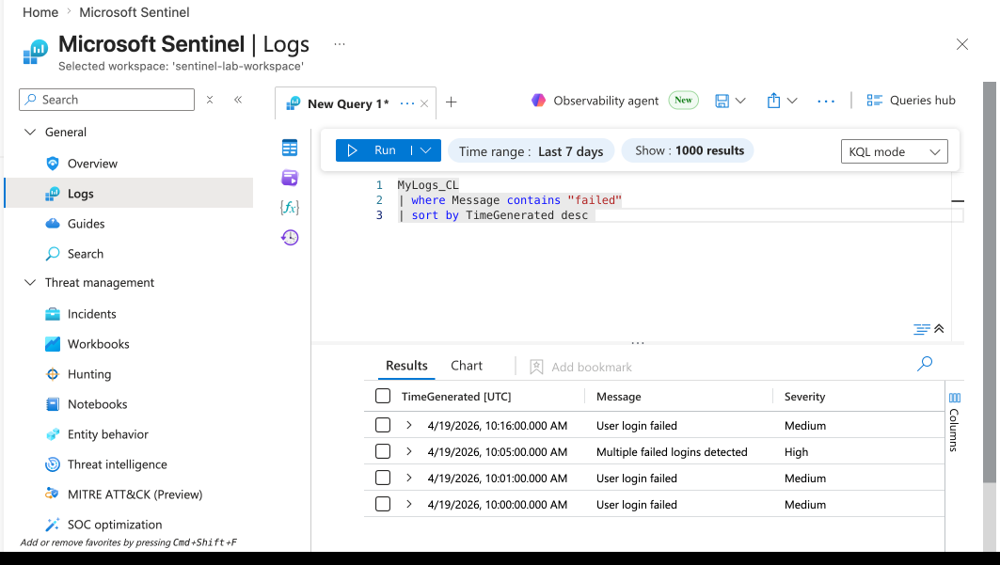
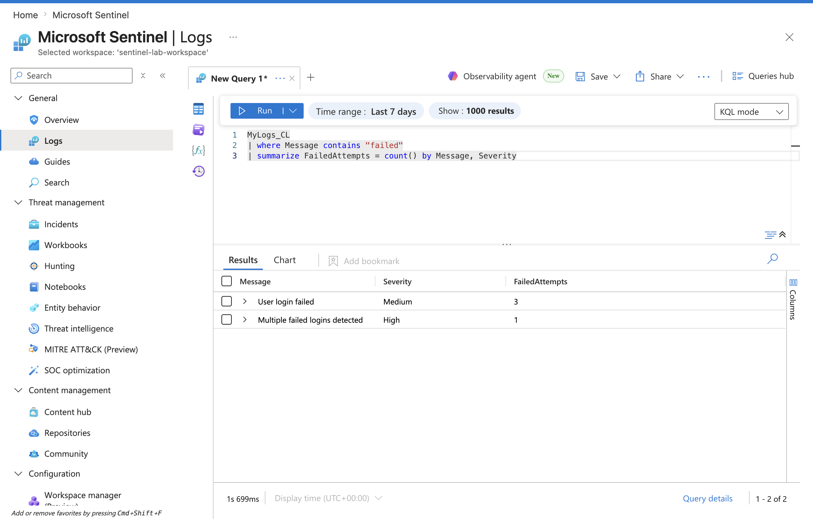
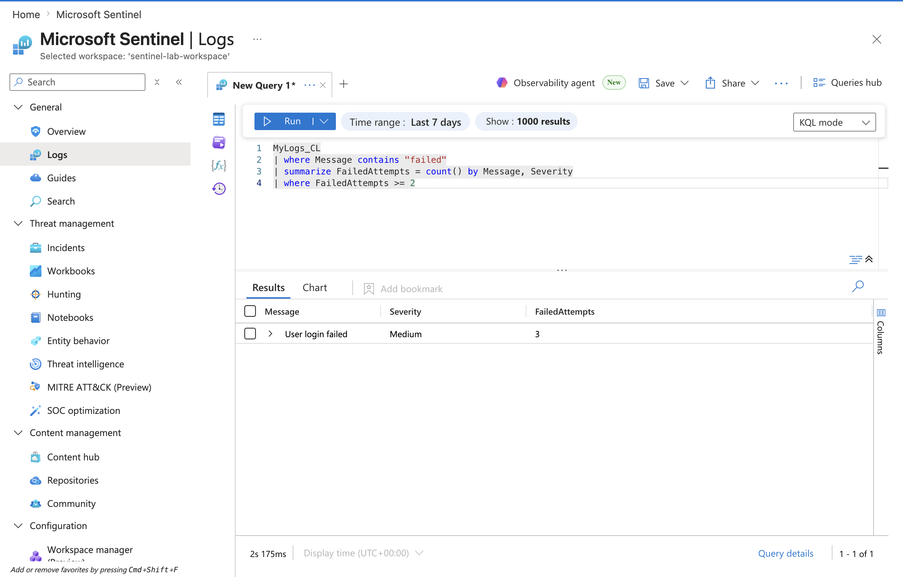
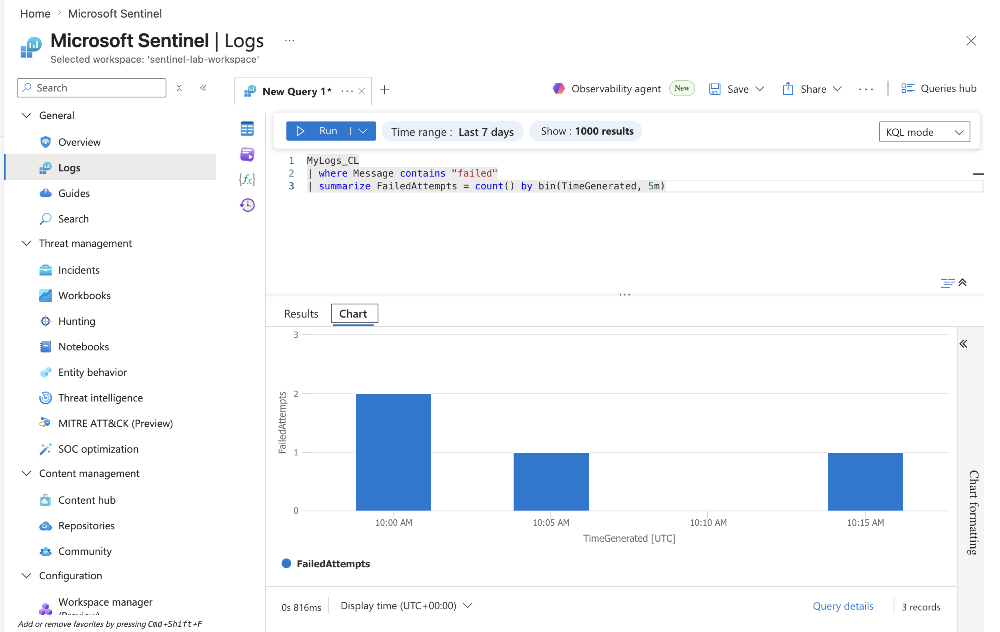

Project 1: Failed Login Detection 

Objective
Detect repeated failed login attempts indicating potential brute force attacks. 

Data Source
Custom logs ingested into Microsoft Sentinel (MyLogs_CL)
---

## Step 1: Identify failed logins
```kql
MyLogs_CL
| Where Message contains "failed"
| sort by TimeGenerated desc
```
## Output

---

## Step 2: Analyze frequency

```kql
MyLogs_CL
| where Message contains "failed"
| summarize FailedAttempts = count() by Message
```
## Output

---

## Step 3: Detect suspicious activity
```kql
MyLogs_CL
| where Message contains "failed"
| summarize FailedAttempts = count() by Message, Severity
| where FailedAttempts >= 2
```
## Output

---

## Step 4: Timeline analysis

```kql
MyLogs_CL
| where Message contains "failed"
| summarize FailedAttempts = count() by bin(TimeGenerated, 5m)
```

## Output


---

## Conclusion
Suspicious login activity detected. Recommend monitoring and alert creation 
