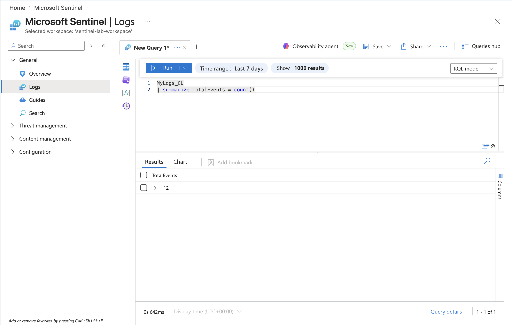
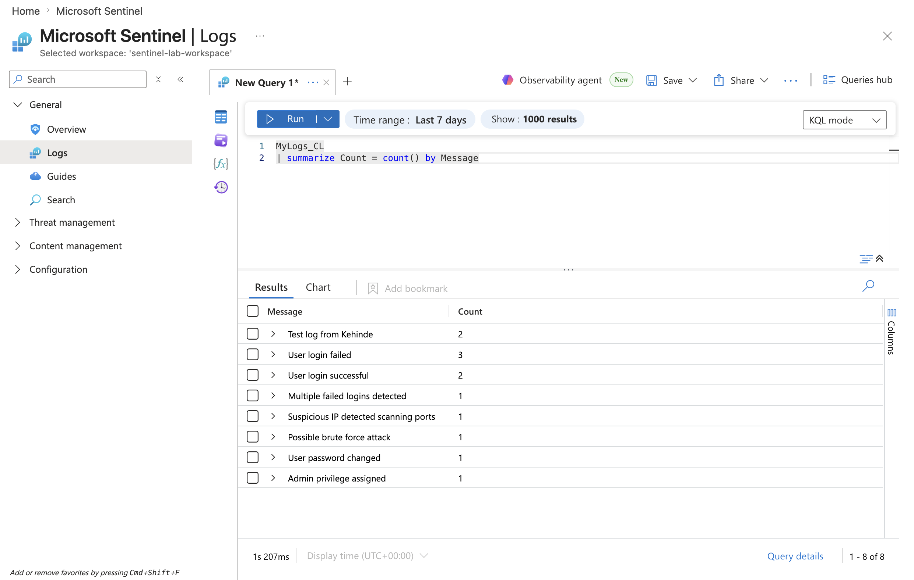
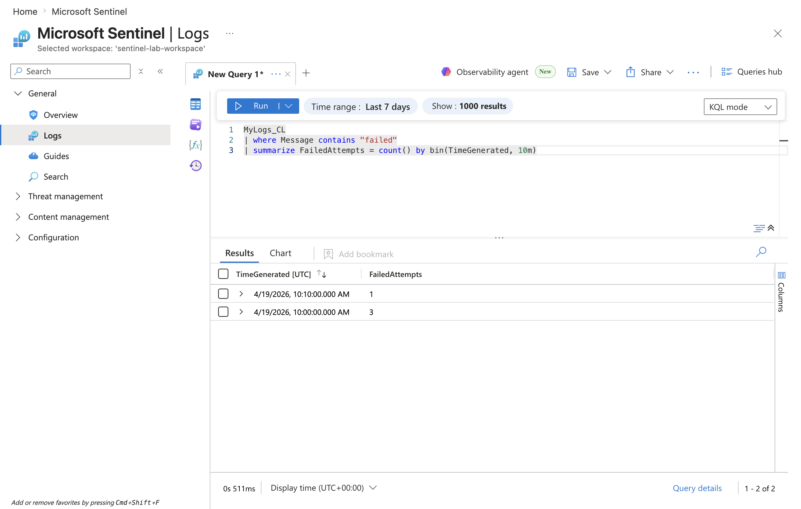

# Project 2: Log Anomaly Detection

## Objective
Identify abnormal patterns in login activity using time-based analysis.

## Data Source
Custom logs ingested into Microsoft Sentinel

---

## Step 1: Establish baseline activity
```kql
MyLogs_CL
| summarize TotalEvents = count()
```

## Output
Shows total number of log events in the dataset

---

## Step 2: Compare event types
```kql
MyLogs_CL
| summarize Count = count() by Message
```
## Output
Displays distribution of log types (failed vs successful logins)

---

## Step 3: Analyze event timeline
```kql
MyLogs_CL
| summarize Count = count() by bin(TimeGenerated, 10m)
| sort by TimeGenerated asc
```
## Output
Visualizes how events are distributed over time

---
