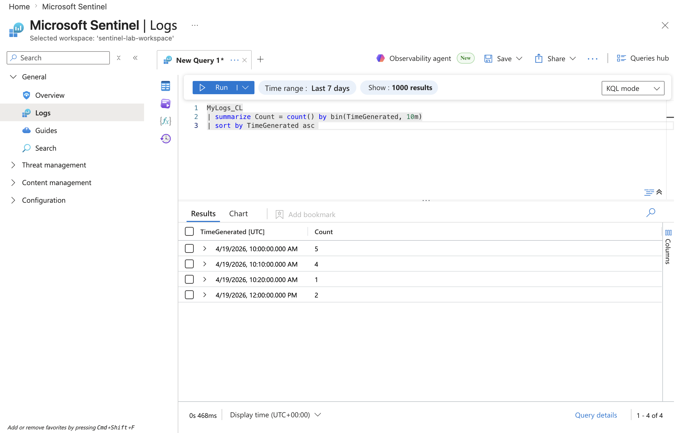
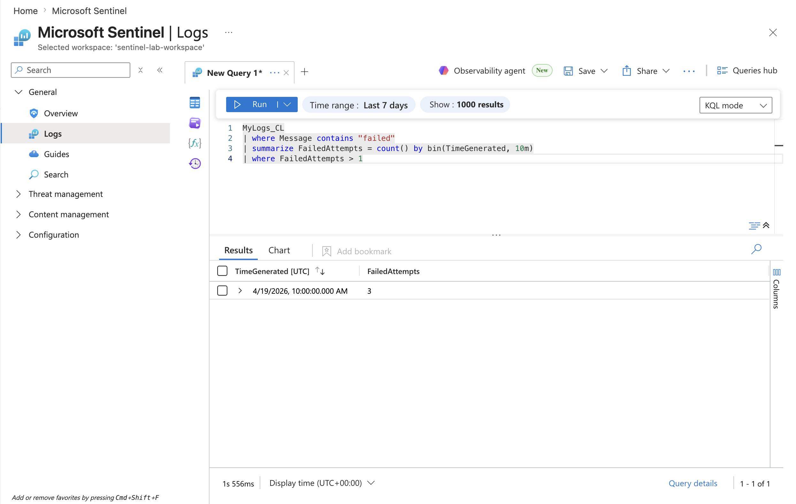

# Project 2: Log Anomaly Detection

## Objective
Identify abnormal patterns in login activity using time-based analysis.

## Data Source
Custom logs ingested into Microsoft Sentinel

---

## Step 1: Establish baseline activity
```kql
MyLogs_CL
| summarize TotalEvents = count()
```

## Output
Shows total number of log events in the dataset

---

## Step 2: Compare event types
```kql
MyLogs_CL
| summarize Count = count() by Message
```
## Output
Displays distribution of log types (failed vs successful logins)

---

## Step 3: Analyze event timeline
```kql
MyLogs_CL
| summarize Count = count() by bin(TimeGenerated, 10m)
| sort by TimeGenerated asc
```
## Output
Visualizes how events are distributed over time

---

## Step 4: Failures over time
```kql
MyLogs_CL
| where Message contains "failed"
| summarize FailedAttempts = count() by bin(TimeGenerated, 10m)
```
## Output
Shows failed login attempts grouped over time

---

## Step 5: Suspicious Spikes
```kql
MyLogs_CL
| swhere Message contains "failed"
| summarize FailedAttempts = count () by bin (TimeGenerated, 10m)
| where FailedAttempts > 1
```
## Output
The results show time intervals where failed login attempts exceed normal levels, indicating potential attack patterns or abnormal behavior

---

## Conclusion
Time based analysis of Login activity revealed periods with increased failed login attempts, indicating abnormal behavior. These spikes suggest potential brute-force or unauthorized access attempts. By aggregating events over time and filtering for higher failure counts, it becomes easier to distinguish normal activity from suspicious patterns.

Recommendation: Implement monitoring and alerting for repeated failed login attempts to enable early detection of potential attacks.

